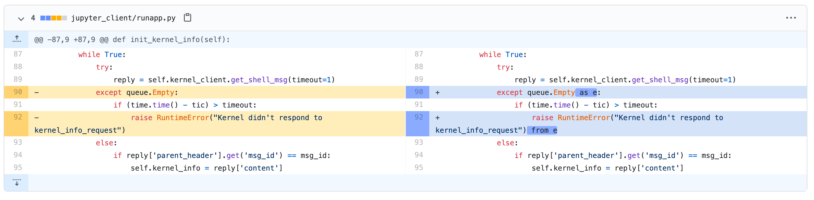
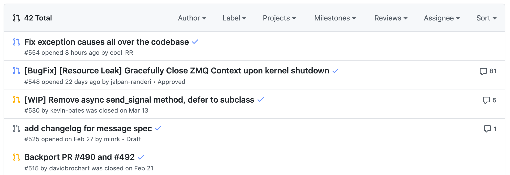
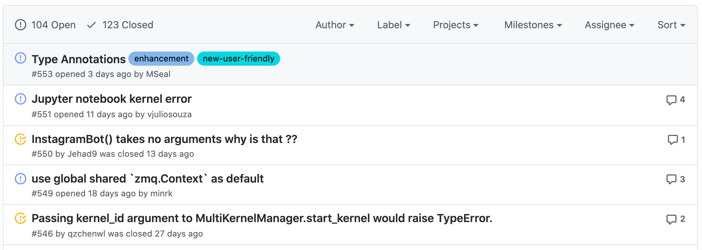

# github-colorblind-theme
A css theme for github.com, changing icons, diff and buttons to colorblind-friendly colors.

## Install
1. Install the **Stylus** extension:
   - [Chrome](https://chrome.google.com/webstore/detail/stylus/clngdbkpkpeebahjckkjfobafhncgmne?hl=en) 
   - [Firefox](https://addons.mozilla.org/en-US/firefox/addon/styl-us/)
2. Install the theme: [Github-Colorblind-Theme](https://userstyles.org/styles/185247/github-colorblind-theme)

## Screenshots

## Color substitutions:
- `green-subs`:  `#648FFF`
- `green-subs-light`:  `#8AABFF`
- `green-subs-lighter`:  `#D5E3F9`
- `red-subs`:  `#FFB000`
- `red-subs-light`:  `#FFD371`
- `red-subs-lighter`:  `#FFEEBA`

## Credits
- `diff` color choice based on [Daniel Hemberger: GitHub Diff Colorblind-Friendly](https://userstyles.org/styles/149864/github-diff-colorblind-friendly)
- Color scheme modified from IBM Design Library, with the help of the website [Coloring for Colorblindness
](https://davidmathlogic.com/colorblind/#%23648FFF-%238AABFF-%23FFEEBA-%23FFD371-%23FFB000)
- Installation instructions based on [burglarbenson/Jupyter-Atom-Dark-Theme](https://github.com/burglarbenson/Jupyter-Atom-Dark-Theme)

## Contribute
Any additions or modifications to the color palette are very welcome. I am not colorblind myself, so feedback would be great!

---
> ⚠️ Warning: Avoid the Stylish extension, see [here](https://github.com/jupyterlab/jupyterlab/issues/3844#issuecomment-372986375)
